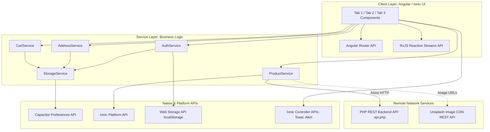

# Academic Technical Report: Application Programming Interfaces (APIs) & Service Architecture in GlowBeauty 2.0

**Course:** Programación de Móviles II  
**Project:** GlowBeauty — Cross-Platform E-Commerce Application  
**Framework:** Ionic 9.x / Angular 22.x / Capacitor 8.x  
**Document Type:** Technical & Architectural Systems Report  

---

## 1. Executive Summary

This report presents a rigorous examination of all Application Programming Interfaces (APIs), software communication protocols, hardware abstraction layers, and architectural interfaces implemented within the **GlowBeauty 2.0** application. 

In modern cross-platform software engineering, the term **API** encompasses both:
1. **External / Network APIs:** Remote web services accessed via HTTP/HTTPS request-response cycles.
2. **Platform & Device APIs:** Native bridge abstractions providing programmatic access to hardware sensors, operating system storage, and device lifecycle states.
3. **Application & Library APIs:** Programmatic contracts provided by frameworks (Angular, Ionic, RxJS) that facilitate reactive state propagation, navigation, and view rendering.

---

## 2. Global Architecture & API Topology



---

## 3. Comprehensive Inventory of APIs & Implementations

### 3.1 Custom RESTful Backend API (PHP / MySQL / Apache)
* **API Category:** Remote Web Service (HTTP REST API)
* **Endpoint URL:** 
  * Browser / Web Environment: `http://localhost/backend/api.php`
  * Android Emulator Environment: `http://10.0.2.2/backend/api.php`
* **Transport Protocol:** HTTP/1.1 via TCP
* **Data Interchange Format:** JSON (`application/json`)
* **HTTP Method:** `GET`
* **Purpose:** Acts as the primary backend data provider for catalog products, fetching price, inventory, category, and metadata from the server-side database.
* **Location in Project Codebase:**
  * File: [`src/app/services/product.service.ts`](file:///c:/Users/eduar/Documents/ISW/Cuatri%209/3-%20Programacion%20de%20moviles%20II/ProjectMobileII/BeautyStore_2.0/src/app/services/product.service.ts#L10)
  * Lines: 10, 160–177
* **Code Reference:**
  ```typescript
  // Dynamic host determination based on runtime platform
  if (this.platform.is('android')) {
    this.apiUrl = 'http://10.0.2.2/backend/api.php';
  } else {
    this.apiUrl = 'http://localhost/backend/api.php';
  }

  // Network call with timeout fallback
  const response = await axios.get(this.apiUrl, { timeout: 1800 });
  ```

---

### 3.2 Axios HTTP Client Library API
* **API Category:** Client-Side Network Protocol API
* **Package:** `axios` (v1.20.0 or higher)
* **Purpose:** Provides a Promise-based HTTP interface for issuing asynchronous requests with configurable timeouts, request interception, and automatic JSON response serialization.
* **Location in Project Codebase:**
  * File: [`src/app/services/product.service.ts`](file:///c:/Users/eduar/Documents/ISW/Cuatri%209/3-%20Programacion%20de%20moviles%20II/ProjectMobileII/BeautyStore_2.0/src/app/services/product.service.ts#L3)
  * Lines: 3, 170

---

### 3.3 Capacitor Preferences Plugin API
* **API Category:** Native Device Storage Abstraction Layer API
* **Package:** `@capacitor/preferences` (v8.0.1)
* **Native Operating System Mappings:**
  * **Android:** `SharedPreferences` (XML-based native key-value storage)
  * **iOS:** `NSUserDefaults`
  * **Web / Progressive Web App (PWA):** `IndexedDB` or `localStorage`
* **Purpose:** Provides persistent, asynchronous, native-level storage for user authentication tokens, persisted cart state, and custom delivery addresses across application restarts.
* **Core API Methods Used:**
  * `Preferences.set({ key, value })`
  * `Preferences.get({ key })`
  * `Preferences.remove({ key })`
  * `Preferences.clear()`
* **Location in Project Codebase:**
  * Primary Abstraction Service: [`src/app/services/storage.service.ts`](file:///c:/Users/eduar/Documents/ISW/Cuatri%209/3-%20Programacion%20de%20moviles%20II/ProjectMobileII/BeautyStore_2.0/src/app/services/storage.service.ts#L2)
  * Consumers:
    * [`src/app/services/cart.service.ts`](file:///c:/Users/eduar/Documents/ISW/Cuatri%209/3-%20Programacion%20de%20moviles%20II/ProjectMobileII/BeautyStore_2.0/src/app/services/cart.service.ts)
    * [`src/app/services/address.service.ts`](file:///c:/Users/eduar/Documents/ISW/Cuatri%209/3-%20Programacion%20de%20moviles%20II/ProjectMobileII/BeautyStore_2.0/src/app/services/address.service.ts)
    * [`src/app/services/auth.service.ts`](file:///c:/Users/eduar/Documents/ISW/Cuatri%209/3-%20Programacion%20de%20moviles%20II/ProjectMobileII/BeautyStore_2.0/src/app/services/auth.service.ts)

---

### 3.4 Ionic Platform Hardware & Runtime API
* **API Category:** Device Environment & Target Platform Inspection API
* **Package:** `@ionic/angular` / `@ionic/core`
* **Purpose:** Programmatically queries device attributes, viewport characteristics, operating system families (`android`, `ios`, `desktop`, `mobile`), and platform-specific capabilities at runtime.
* **Key Use Case in Code:** Inspecting whether the application is running inside the Android Dalvik/ART virtual machine or a desktop WebKit/Blink browser engine, redirecting network loops accordingly (`10.0.2.2` vs `localhost`).
* **Location in Project Codebase:**
  * File: [`src/app/services/product.service.ts`](file:///c:/Users/eduar/Documents/ISW/Cuatri%209/3-%20Programacion%20de%20moviles%20II/ProjectMobileII/BeautyStore_2.0/src/app/services/product.service.ts#L2)
  * Lines: 2, 160–166

---

### 3.5 HTML5 Web Storage API (`window.localStorage`)
* **API Category:** W3C Standard Browser Storage API
* **Purpose:** Synchronous browser key-value store utilized as an immediate local session fallback for user credentials and auth tokens prior to native preference synchronization.
* **Location in Project Codebase:**
  * File: [`src/app/services/auth.service.ts`](file:///c:/Users/eduar/Documents/ISW/Cuatri%209/3-%20Programacion%20de%20moviles%20II/ProjectMobileII/BeautyStore_2.0/src/app/services/auth.service.ts#L14)
  * Lines: 14, 28, 41, 56

---

### 3.6 Reactive Extensions for JavaScript (RxJS) API
* **API Category:** Asynchronous Reactive Dataflow & Event Processing API
* **Package:** `rxjs` (v7.x)
* **Core Primitives Utilized:**
  * `BehaviorSubject<T>`: Holds current state value and emits updates to current and future subscribers.
  * `Observable<T>`: Read-only stream piped to Angular's `AsyncPipe` in HTML templates.
  * `Subscription`: Lifecycle management interface to prevent memory leaks during component destruction.
* **Purpose:** Powers the global reactive state machine across all tabs, ensuring that cart counters, shopping bag subtotals, and address lists update in real-time across disconnected views without manual component re-rendering.
* **Location in Project Codebase:**
  * [`src/app/services/cart.service.ts`](file:///c:/Users/eduar/Documents/ISW/Cuatri%209/3-%20Programacion%20de%20moviles%20II/ProjectMobileII/BeautyStore_2.0/src/app/services/cart.service.ts#L4) (`items$`, `count$`, `total$`)
  * [`src/app/services/address.service.ts`](file:///c:/Users/eduar/Documents/ISW/Cuatri%209/3-%20Programacion%20de%20moviles%20II/ProjectMobileII/BeautyStore_2.0/src/app/services/address.service.ts#L4) (`addresses$`)
  * [`src/app/services/auth.service.ts`](file:///c:/Users/eduar/Documents/ISW/Cuatri%209/3-%20Programacion%20de%20moviles%20II/ProjectMobileII/BeautyStore_2.0/src/app/services/auth.service.ts#L4) (`currentUser$`)
  * [`src/app/tabs/tabs.page.ts`](file:///c:/Users/eduar/Documents/ISW/Cuatri%209/3-%20Programacion%20de%20moviles%20II/ProjectMobileII/BeautyStore_2.0/src/app/tabs/tabs.page.ts#L4) (`cartCount$`)

---

### 3.7 Angular Router & Navigation API
* **API Category:** Client-Side Single Page Application (SPA) Routing & Guard API
* **Package:** `@angular/router`
* **Core Constructs:** `RouterModule`, `Routes`, `Router`, `NavController`, `routerLink`, `CanActivateFn`
* **Purpose:** Manages URL state, dynamic lazy-loading of feature modules (`loadChildren`), hierarchical nested route outlets (`ion-tabs` child routes), and route authorization guards.
* **Location in Project Codebase:**
  * Root Routing: [`src/app/app-routing.module.ts`](file:///c:/Users/eduar/Documents/ISW/Cuatri%209/3-%20Programacion%20de%20moviles%20II/ProjectMobileII/BeautyStore_2.0/src/app/app-routing.module.ts)
  * Tabs Sub-Routing: [`src/app/tabs/tabs-routing.module.ts`](file:///c:/Users/eduar/Documents/ISW/Cuatri%209/3-%20Programacion%20de%20moviles%20II/ProjectMobileII/BeautyStore_2.0/src/app/tabs/tabs-routing.module.ts)
  * Route Guard: [`src/app/guards/auth.guard.ts`](file:///c:/Users/eduar/Documents/ISW/Cuatri%209/3-%20Programacion%20de%20moviles%20II/ProjectMobileII/BeautyStore_2.0/src/app/guards/auth.guard.ts)
  * Navigation Controllers: [`src/app/tabs/tabs.page.ts`](file:///c:/Users/eduar/Documents/ISW/Cuatri%209/3-%20Programacion%20de%20moviles%20II/ProjectMobileII/BeautyStore_2.0/src/app/tabs/tabs.page.ts#L2)

---

### 3.8 Ionic UI Controller Overlay APIs
* **API Category:** Programmatic User Interface & Notification Service APIs
* **Package:** `@ionic/angular`
* **Constructs:** `ToastController`, `AlertController`, `ModalController`
* **Purpose:** Programmatically generates modal dialogs, native confirmation sheets (e.g., confirming item removal from shopping bag), and non-intrusive HUD toast feedback overlays.
* **Location in Project Codebase:**
  * [`src/app/tab1/tab1.page.ts`](file:///c:/Users/eduar/Documents/ISW/Cuatri%209/3-%20Programacion%20de%20moviles%20II/ProjectMobileII/BeautyStore_2.0/src/app/tab1/tab1.page.ts#L2) (Toast notifications upon cart addition)
  * [`src/app/tab2/tab2.page.ts`](file:///c:/Users/eduar/Documents/ISW/Cuatri%209/3-%20Programacion%20de%20moviles%20II/ProjectMobileII/BeautyStore_2.0/src/app/tab2/tab2.page.ts#L2) (Alert dialogs for cart deletion & coupon feedback)
  * [`src/app/tab3/tab3.page.ts`](file:///c:/Users/eduar/Documents/ISW/Cuatri%209/3-%20Programacion%20de%20moviles%20II/ProjectMobileII/BeautyStore_2.0/src/app/tab3/tab3.page.ts#L2) (Address CRUD confirmation prompts)

---

### 3.9 Unsplash Dynamic Image Delivery & Transformation API (CDN)
* **API Category:** Cloud Media Content Delivery Network (CDN) API
* **Base URL:** `https://images.unsplash.com/photo-...`
* **Query Parameters Used:**
  * `auto=format`: Automatically serves WebP or AVIF based on browser `Accept` headers.
  * `fit=crop`: Crops images with smart focal point preservation.
  * `w=600` / `w=1000`: Dynamic image resizing to conserve mobile cellular bandwidth.
  * `q=80` / `q=85`: Lossy compression optimization.
* **Purpose:** Supplies responsive, high-fidelity luxury cosmetic product photography.
* **Location in Project Codebase:**
  * Default Product Catalog: [`src/app/services/product.service.ts`](file:///c:/Users/eduar/Documents/ISW/Cuatri%209/3-%20Programacion%20de%20moviles%20II/ProjectMobileII/BeautyStore_2.0/src/app/services/product.service.ts#L21)
  * Interactive Hero Carousel: [`src/app/tab1/tab1.page.ts`](file:///c:/Users/eduar/Documents/ISW/Cuatri%209/3-%20Programacion%20de%20moviles%20II/ProjectMobileII/BeautyStore_2.0/src/app/tab1/tab1.page.ts#L48)

---

## 4. Summary Matrix of APIs

| # | API Name | Category | Scope / Target | Location in Codebase |
|---|---|---|---|---|
| **1** | Custom PHP REST API | Web Service / REST | Catalog Data Provider | `src/app/services/product.service.ts` |
| **2** | Axios HTTP Client | Library API | HTTP Networking & Promises | `src/app/services/product.service.ts` |
| **3** | Capacitor Preferences API | Native Bridge Plugin | Device Persistent Key-Value Storage | `src/app/services/storage.service.ts` |
| **4** | Ionic Platform API | Hybrid Runtime API | Android / Web Runtime Detection | `src/app/services/product.service.ts` |
| **5** | HTML5 localStorage API | Standard Web API | Browser Session Fallback Storage | `src/app/services/auth.service.ts` |
| **6** | RxJS Reactive Streams | Library API | Asynchronous Cross-Component State | `src/app/services/*.service.ts` |
| **7** | Angular Router API | Framework API | SPA Navigation & Guards | `src/app/app-routing.module.ts`, `tabs-routing.module.ts` |
| **8** | Ionic UI Controllers | Framework API | Toasts, Confirmations & Modals | `src/app/tab1/`, `src/app/tab2/`, `src/app/tab3/` |
| **9** | Unsplash CDN REST API | Remote Media Service | Optimized WebP/JPEG Image CDN | `product.service.ts`, `tab1.page.ts` |

---

## 5. Conclusion

The architecture of **GlowBeauty 2.0** reflects a modern, decoupled, multi-tiered mobile architecture. By abstracting native storage behind `StorageService` via Capacitor Preferences, delegating network operations to `ProductService` via Axios and the PHP REST backend, and driving view synchronization through RxJS BehaviorSubjects, the system achieves complete platform agnosticism between mobile native runtimes (Android/iOS) and desktop web browsers.
